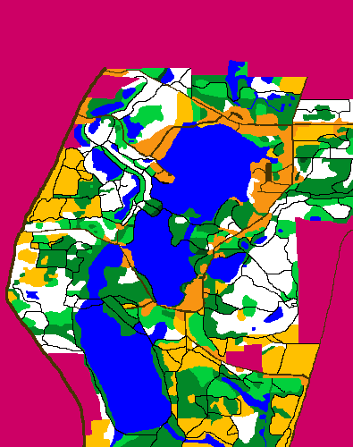

# Orienteering using A Star
In this project I implement my own version of googlemaps !
  Primary aim of this project is to find the shortest route between two points given the constraints of distance, elevations and change in seasons.
 
# Primary Terrain
The primary terrain is given in the terrain.png file and the elevations are stored in the elevations.txt file.

